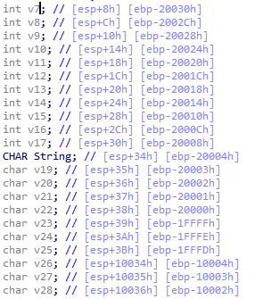
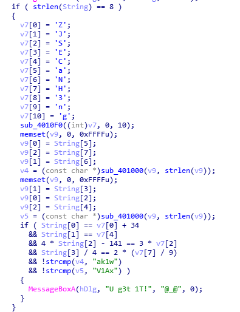

- 查壳,没壳.

- 可以看出来v7和String是数组和字符串,双击跟进,摁a定义.发现v7是11位,String是8位.v6是四个为1位.故array size 填43(我也不知道为啥是43,但少一个就是对的)String 填8
## 大概逻辑:

 __ v7初始化
 __ sub_4010F0(v7)
 __ v9赋值-String
 __ v4=sub_401000(v9)
 __ v9赋值-String
 __ v5=sub_401000(v9)
 __ String[1][2][3]认证
 __ v4,v5确认
 
 ##
 -  sub_4010F0分析:
 代码不长,输出确定,可以直接把反汇编的翻译为C,得到结果v9=3CEHJNSZgn
 - sub_401000分析:
 由位数除3*4和替换表得,应该是base64加密,由v4,v5确认回推出v9的值,再推出string的值
 
 ```pythonimport base64
          v9='3CEHJNSZgn5'
          String1= chr(ord(v9[0]) + 34)
          String1+=v9[4]
          # String1+=chr((3 * ord(v9[2])+141)//4)
          # String1+=chr(2*(int(ord(v9[7]) // 9))*4)
          String1+='WP1jMp'
          print(String1)
```