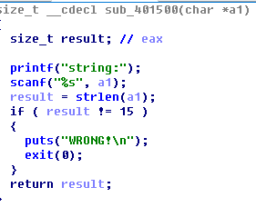

重建pe,修复upx


len=15

sub_401553:a2=114 a1=10 v3为输入
v10=1->
v4[v8] != a1[v10+1]
``````
拿v4[v8]去还原v3


boom:
en5oy_

joker:
fkcd agd;vka{&;pc_MZq7f->23


wrong:
  for ( i = 0; i <= 23; ++i )
  {
    if ( i & 1 )
    {
      result = &a1[i];
      a1[i] -= i;
    }
    else
    {
      result = &a1[i];
      a1[i] ^= i;
    }
  }
  return result;
}