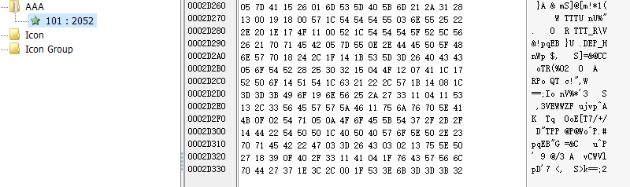

#### 知识点:
- sha1加密所得的字符串为40位,MD5加密所得字符串为32位,
- CryptCreateHash(phProv, 0x8003u, 0, 0, &phHash) )第二个参数是加密方式,0x8003u为MD5,0x8004u为SHA1
- 文件头标志位为前六位
## 正文
- 查壳,无壳.
#### 流程

- tar为6位数,大于100000
- tar后填上@DBApp,
- v0为tar长度,=12
- sub_40100A(tar,v0,&String1)
- String1==6E32D0943418C2C33385BC35A1470250DD8923A9
- String为6位数
- String后填上tar
- sub_401019(String, strlen(String), &String1)-->string1=MD5(string)
- 27019e688a4e62a649fd99cadaafdb4e==String1
- sub_40100F(&String)
#### 对sub_40100A进行分析
- CryptHashData:为CryptoAPI提供的Hash解密函数.输入为6位数="@DBApp",输出为String1=6E32D0943418C2C33385BC35A1470250DD8923A9
用脚本爆破sha1:
```python
import hashlib
for i in range(100000,999999):
    h2 = hashlib.sha1((str(i)+'@DBApp').encode())#sha1改为题目需要的算法
    flags = h2.hexdigest()
    if "6e32d0943418c2c33385bc35a1470250dd8923a9" == flags:
            print (str(i)+'@DBApp')
            print (flags)
```
得出tar=123321@DBApp
- 输入前六位,发现正确
###  sub_401019分析
与第一个大体相同,不过是MD5加密.md5加密是不可能被暴力破解的，因为有6+6+6个字符.只好先看下一个函数.
下面有个比较函数,跟进看看
### sub_4014D0
- FindResource:一个计算机函数。该函数确定指定模块中指定类型和名称的资源所在位置.百度一下函数,发现是找文件的
- sub_401005:一会再看
- CreateFile:打开或创建一个文件,这里创建了一个rtf文件,根据题目发现这应该是关键,然后想方法都这个函数.
- WriteFile:把sub_401005处理的数据写到CreateFile中
用resource_hacker读取文件里的内容发现数据经过处理,分析处理函数为sub_401005.跟进.
### sub_401005
作用是让AAA里面的内容和String异或,结果生成了rtf文件

我们目的是求出String里的密码,String的构成为6位数字+'123321@DBApp'所以只需要异或前六位机能求出.
rtf的前六位标志头为'{\rtf1'.写脚本:
```python
fi=[0x05,0x7D,0x41,0x15,0x26,0x01]
a='{\\rtf1'
b=''
for i in range(6):
    b+=chr(ord(a[i])^fi[i])
    print(b)
```
得到结果:'~!3a@0'
然后把程序跑一遍,发现多了个rtf文件.里面就是flag
程序的逻辑就是两个Hash判断,如果都符合就把字符串和AAA里的内容异或,然后把异或结果内容写在这个1生成的rtf中.
逻辑出错的地方就是把密码用于生成过程,而生成过程又造成密码泄露