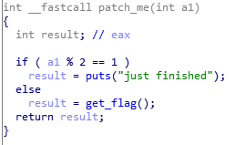

- Linux,量的值要倒过来
####分析:
关键函数patch_me

跟进get_flag,发现一个switch.
- case1:s='f1'+'f2'
- case4:将s2赋值
- case5:将s2用类凯撒加密.
脚本:(f2字符串倒过来)
```python
f2='icug`of'
v1=0
v3=''
for i in range(8):
    if i%2==1:
        v1=ord(f2[i])-2
    else:
        v1=ord(f2[i])-1
    v3+=chr(v1)
print(v3)
```
然后得出str:
GXY{do_not_hate_me}