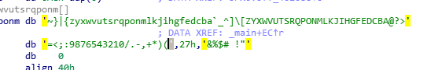

- 脱壳
#### 基本逻辑
比较逻辑无敌简单,就只需要一个find()
    Req+=chr(byt.index(v4[i])+1)
坑1:

一定要注意下面还有一半
坑2:注意里面有个29h...
```python
v41='*F\'\"N,'
v42='\"(I?+@'
v4=v41+v42
Req=''
byt='~}|{zyxwvutsrqponmlkjihgfedcba`_^]\\[ZYXWVUTSRQPONMLKJIHGFEDCBA@?>=<;:9876543210/.-,+*)(\'&%$# !\"'
for i in byt:
    print(hex(ord(i)))
for i in range(12):
    Req+=chr(byt.index(v4[i])+1)
    print(Req)
    print('ACTF{'+Req+'}')
```